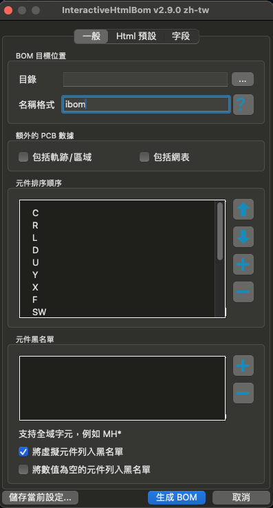
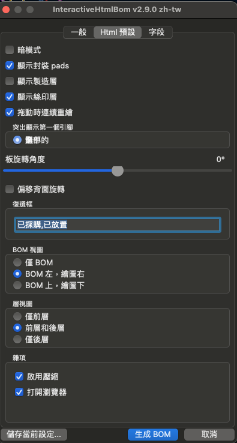
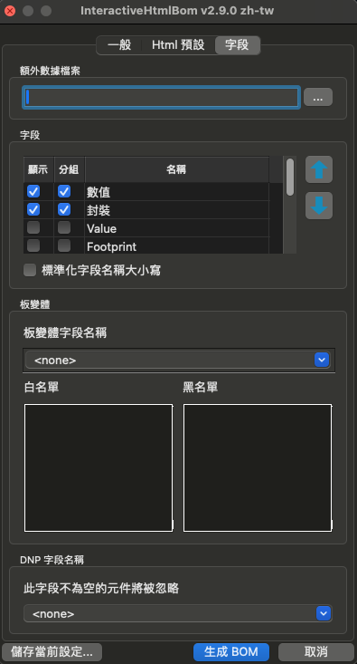
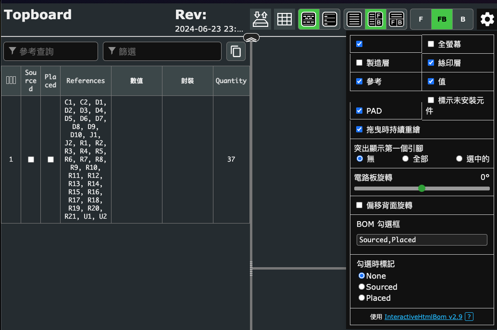

# Interactive HTML BOM plugin for KiCad
## Supports EasyEDA, Eagle, Fusion360 and Allegro PCB designer

# 將介面完成中文化

This plugin generates a convenient Bill of Materials (BOM) listing with the
ability to visually correlate and easily search for components and their placements
on the PCB. It is particularly useful when hand-soldering a prototype, as it allows
users to quickly find locations of components groups on the board. It is also possible
to reverse lookup the component group by clicking on a footprint on the board drawing.

The plugin utilizes Pcbnew python API to read PCB data and render silkscreen, fab layer,
footprint pads, text, and drawings. BOM table fields and grouping is fully configurable,
additional columns, such as a manufacturer ID, can be added in Schematic editor and
imported either through the netlist file, XML file generated by Eeschema's internal
BOM tool, or from board file itself.

There is an option to include tracks/zones data as well as netlist information allowing
dynamic highlight of nets on the board.

For full description of functionality see [wiki](https://github.com/openscopeproject/InteractiveHtmlBom/wiki).

Generated html page is fully self contained, doesn't need internet connection to work
and can be packaged with documentation of your project or hosted anywhere on the web.

[A demo is worth a thousand words.](https://openscopeproject.org/InteractiveHtmlBomDemo/)

## Installation and Usage

See [project wiki](https://github.com/openscopeproject/InteractiveHtmlBom/wiki/Installation) for instructions.

## License and credits

Plugin code is licensed under MIT license, see `LICENSE` for more info.

Html page uses [Split.js](https://github.com/nathancahill/Split.js),
[PEP.js](https://github.com/jquery/PEP) and (stripped down)
[lz-string.js](https://github.com/pieroxy/lz-string) libraries that get embedded into
generated bom page.

`units.py` is borrowed from [KiBom](https://github.com/SchrodingersGat/KiBoM)
plugin (MIT license).

`svgpath.py` is heavily based on
[svgpathtools](https://github.com/mathandy/svgpathtools) module (MIT license).
